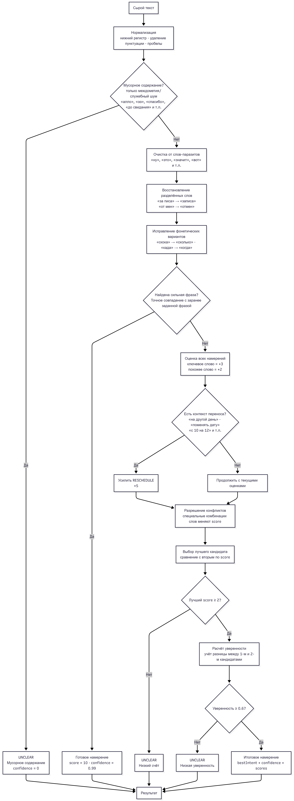

## Запуск

```bash
node index
```

## Схема



## Почему такой подход?

Выбрал самую очевидную последовательность действий. Сначала нужно привести текст в нормальный единый вид — это включает нормализацию, очистку, восстановление. Потом проверяются сильные фразы, так как они однозначно указывают на намерение. Если точного совпадения нет, то используется набор ключевых слов с алгоритмом Левенштейна для учёта мелких ошибок при распознавании речи. Далее учитывается контекст переноса записи. В самом конце, если лучшее намерение получило счёт меньше 2 баллов или уверенность ниже 0.6, то программа отдаёт UNCLEAR.
